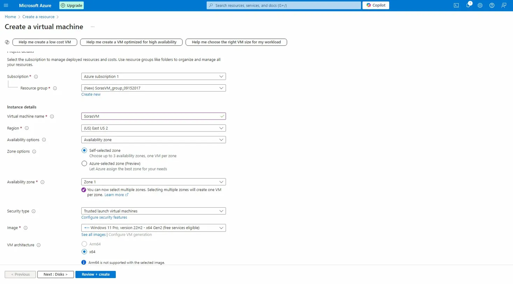
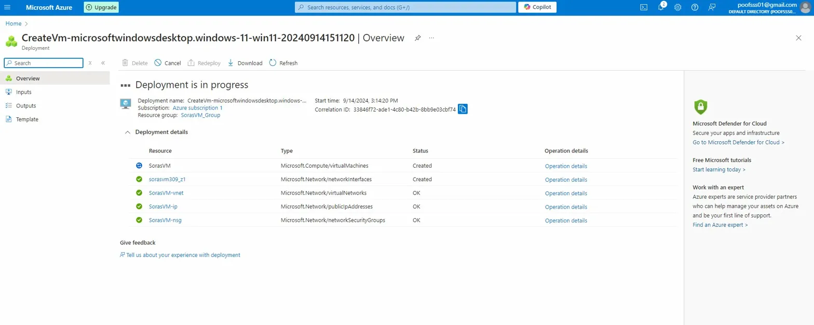
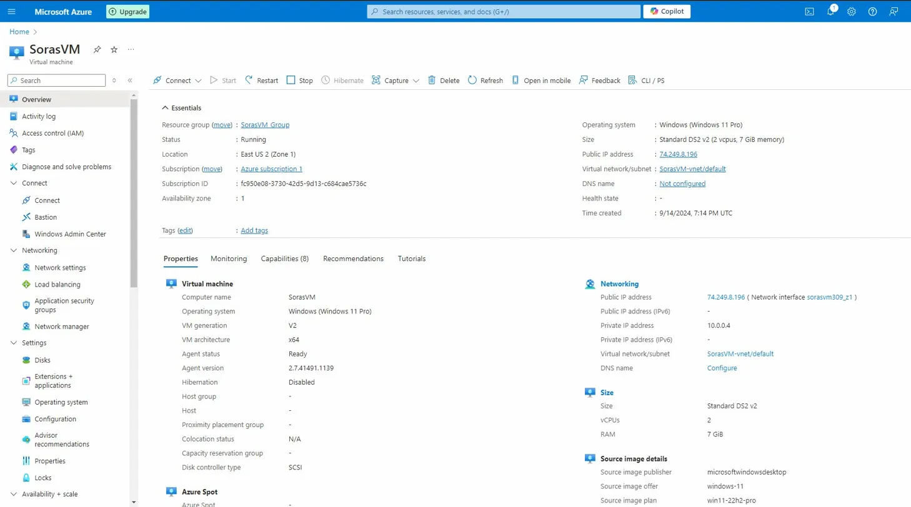
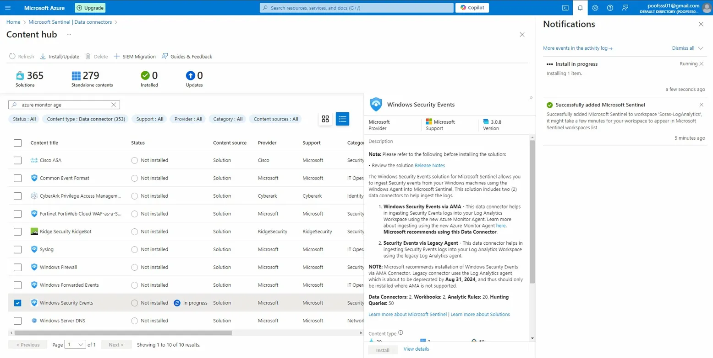
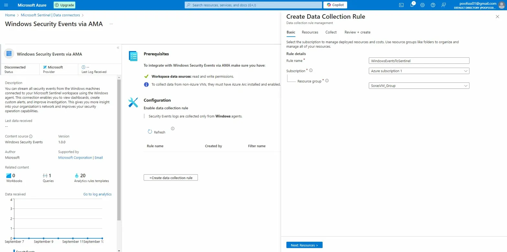
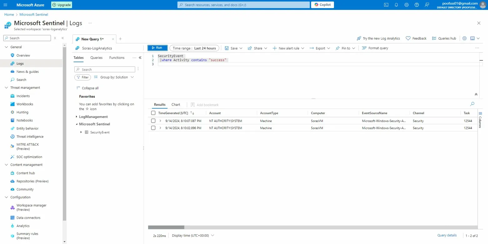
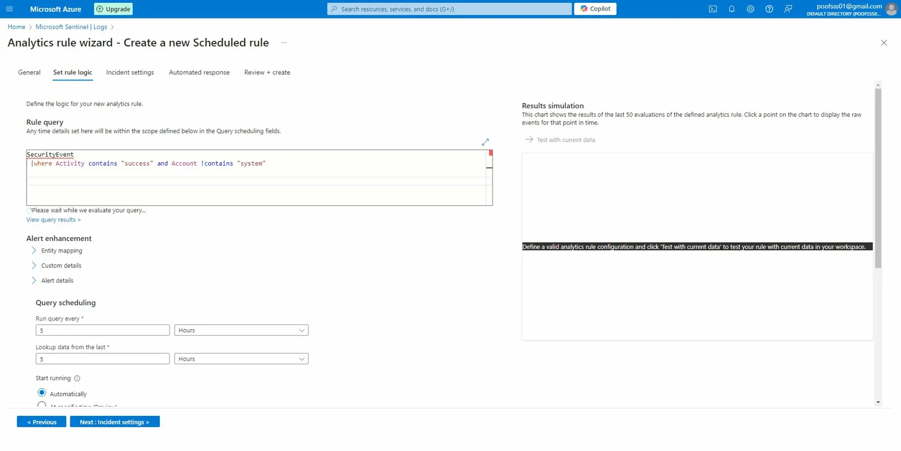
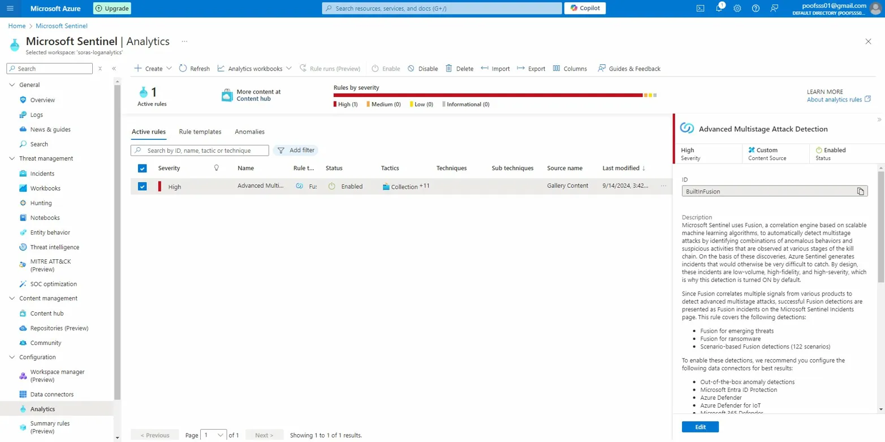
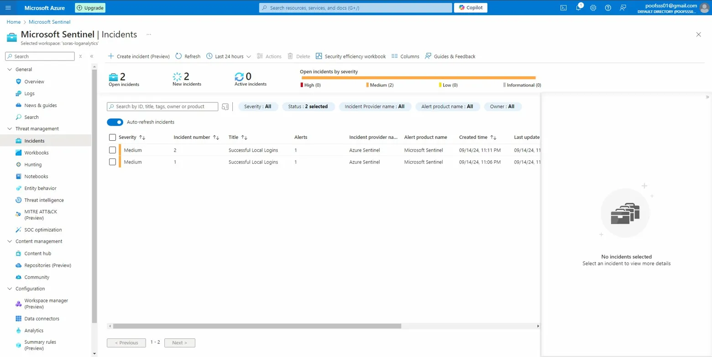
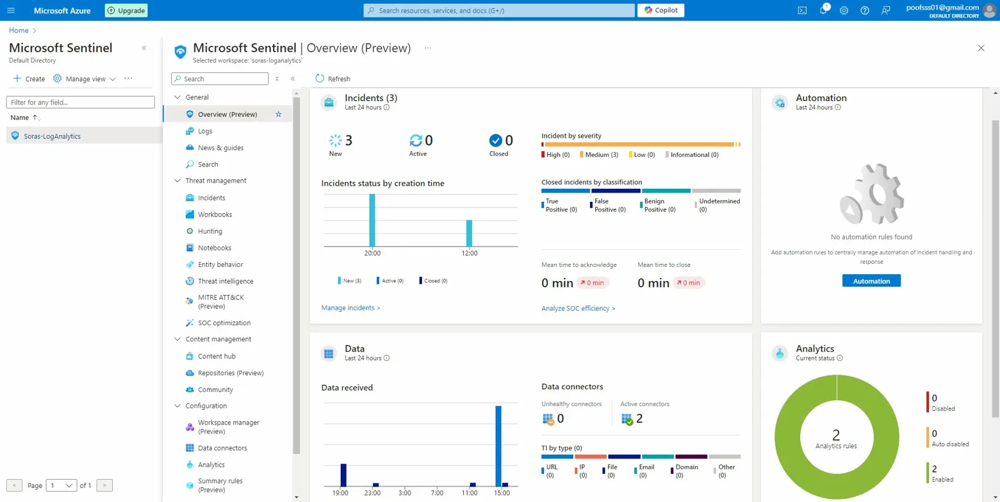

# 🛡️ Azure Sentinel SIEM & Threat Detection Lab


> A self-taught hands-on lab where I deployed a Windows 11 virtual machine in Microsoft Azure, connected it to Microsoft Sentinel (SIEM), wrote KQL queries to hunt for security events, built custom detection rules, and triggered real incidents — all from scratch.

---

## 📋 Table of Contents

- [Overview](#overview)
- [Technologies Used](#technologies-used)
- [Lab Architecture](#lab-architecture)
- [Step-by-Step Walkthrough](#step-by-step-walkthrough)
- [KQL Queries Written](#kql-queries-written)
- [Results](#results)
- [What I Learned](#what-i-learned)

---

## Overview

This project simulates a basic Security Operations Center (SOC) environment using Microsoft Azure. I built this entirely on my own to get hands-on experience with cloud security monitoring, log analysis, and threat detection — skills that are core to any cybersecurity or cloud operations role.

The goal was simple: spin up a real virtual machine, feed its security logs into a SIEM, write detection logic, and see real incidents get created automatically.

---

## Technologies Used

| Tool | Purpose |
|------|---------|
| **Microsoft Azure** | Cloud infrastructure platform |
| **Azure Virtual Machines** | Deployed a Windows 11 Pro VM (SorasVM) |
| **Microsoft Sentinel** | SIEM — security event monitoring & alerting |
| **Log Analytics Workspace** | Log ingestion and storage (Soras-LogAnalytics) |
| **Windows Security Events via AMA** | Data connector to stream VM logs into Sentinel |
| **KQL (Kusto Query Language)** | Query language used to hunt through security logs |
| **Azure Monitor Agent (AMA)** | Agent installed on VM to collect and forward logs |

---

## Lab Architecture

```
Windows 11 VM (SorasVM)
        │
        │  Security Events (via AMA)
        ▼
Log Analytics Workspace (Soras-LogAnalytics)
        │
        │  Log ingestion
        ▼
Microsoft Sentinel (SIEM)
        │
        ├── KQL Analytics Rules → Alerts
        │
        └── Incidents Dashboard → 3 Incidents: "Successful Local Logins"
```

---

## Step-by-Step Walkthrough

### Step 1 — Create the Virtual Machine

Deployed a Windows 11 Pro VM named **SorasVM** in Azure (East US 2, Zone 1). Configured it with Standard DS2 v2 specs (2 vCPUs, 7 GiB RAM) and set up the virtual network, public IP, and network security group.



---

### Step 2 — VM Deployment Success

All resources deployed successfully — the VM, network interface, virtual network, public IP, and NSG all came up clean.



---

### Step 3 — VM Running

Confirmed **SorasVM** is live and running in Azure with a public IP assigned, Azure Monitor Agent ready, and all networking configured.



---

### Step 4 — Install Windows Security Events Data Connector

From the Sentinel Content Hub, installed the **Windows Security Events** solution. This installs 2 data connectors, 2 workbooks, 20 analytics rule templates, and 50 hunting queries.



---

### Step 5 — Configure Data Collection Rule

Set up the **Windows Security Events via AMA** connector and created a Data Collection Rule named **WindowsEventsToSentinel** to stream security logs from SorasVM directly into Sentinel.



---

### Step 6 — Query Security Logs with KQL

Once logs started flowing in, I wrote KQL queries in the Sentinel Logs panel to hunt for events. First query: filter all `SecurityEvent` records where the activity contains "success" — and got **real results back** from the VM.



---

### Step 7 — Build a Custom Analytics Rule

Used the Analytics Rule Wizard to create a scheduled detection rule using the same KQL logic. Set it to run every 5 hours and look back 5 hours of data — targeting successful logins that aren't system accounts.



---

### Step 8 — Analytics Rules Dashboard

Confirmed the rule is active. The **Advanced Multistage Attack Detection** (Fusion) rule is also enabled — a high-severity ML-based rule that detects multi-stage attacks automatically.



---

### Step 9 — Incidents Generated 🎯

The analytics rule fired and created **real incidents** in Sentinel. Incident #1 and #2 are both titled "Successful Local Logins" with Medium severity — exactly what my detection rule was looking for.



---

### Step 10 — Final Sentinel Overview

The completed Sentinel dashboard showing **3 incidents detected**, 2 active data connectors, 2 analytics rules fully enabled, and live data flowing in across the timeline. This is what a working mini-SOC looks like.



---

## KQL Queries Written

```kql
// Query 1 — Find all successful security events
SecurityEvent
| where Activity contains "success"
```

```kql
// Query 2 — Find successful logins, excluding system accounts
SecurityEvent
| where Activity contains "success" and Account !contains "system"
```

The second query became the basis for the custom analytics rule that triggered the incidents.

---

## Results

| Metric | Result |
|--------|--------|
| VM Deployed | ✅ SorasVM — Windows 11 Pro, Running |
| Sentinel Connected | ✅ Soras-LogAnalytics workspace |
| Data Connectors Active | ✅ 2 connected |
| Analytics Rules | ✅ 2 active rules |
| KQL Queries Written | ✅ 2 custom queries |
| Incidents Generated | ✅ 3 real incidents triggered |

---

## What I Learned

- **How Azure's resource hierarchy works** — subscriptions, resource groups, and how everything ties together
- **What a SIEM actually does** — ingesting logs, correlating events, and surfacing alerts is very different from reading about it
- **KQL basics** — filtering, string matching, and chaining conditions to hunt for specific event patterns
- **How analytics rules work** — writing detection logic and scheduling it to run automatically felt like writing my first security automation
- **The difference between an alert and an incident** — Sentinel groups alerts into incidents, which is how real SOC analysts triage threats
- **End-to-end cloud security monitoring** — going from zero to a working detection pipeline entirely self-taught gave me a much deeper understanding of what blue team work looks like in practice

---

## 📁 Project Structure

```
azure-sentinel-lab/
│
├── README.md
└── screenshots/
    ├── image_20.png  — VM creation config
    ├── image_01.png  — VM deployment success
    ├── image_19.png  — SorasVM running
    ├── image_08.png  — Windows Security Events install
    ├── image_09.png  — Data collection rule config
    ├── image_10.png  — KQL query with live results
    ├── image_12.png  — Analytics rule wizard
    ├── image_13.png  — Analytics rules dashboard
    ├── image_15.png  — Incidents generated
    └── image_21.png  — Final Sentinel overview (3 incidents)
```

---

*Built independently as a self-taught cloud security project. All infrastructure deployed and torn down on a personal Azure subscription.*
